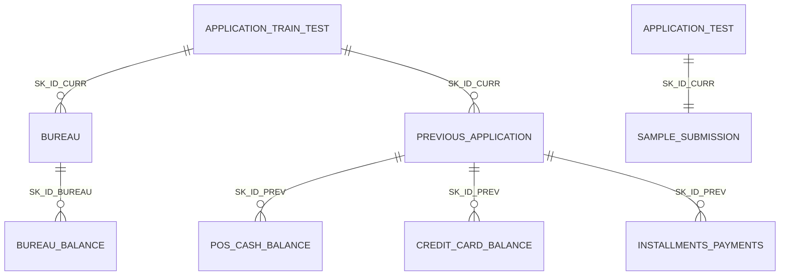

# Home Credit Default Risk 数据介绍

本文档介绍 `data/original/` 中的 Kaggle 竞赛
[Home Credit Default Risk](https://www.kaggle.com/competitions/home-credit-default-risk)
数据文件。这个竞赛的目标是：根据贷款申请人当前申请信息、历史借贷记录和还款记录，
预测申请人是否可能出现还款困难。

## 比赛任务

这是一个二分类信用风险预测问题。

- 每一条主样本代表一笔当前贷款申请，用 `SK_ID_CURR` 标识。
- 训练集 `application_train.csv` 有真实标签 `TARGET`。
- `TARGET=1` 表示申请人出现还款困难；`TARGET=0` 表示没有被标记为还款困难。
- 测试集 `application_test.csv` 没有 `TARGET`，需要模型预测还款困难的概率。
- Kaggle 评价指标是 ROC AUC，提交文件需要包含 `SK_ID_CURR` 和预测概率 `TARGET`。

本地训练集中 `TARGET=1` 的比例约为 8.07%，也就是说，大多数样本是
`TARGET=0`。因此这是一个类别不平衡问题，不能只看准确率；建模时更常用
ROC AUC、PR AUC、召回率等指标一起观察。

## 文件总览

| 文件 | 行数 | 列数 | 作用 |
| --- | ---: | ---: | --- |
| `application_train.csv` | 307,511 | 122 | 当前贷款申请训练集，包含 `TARGET`。 |
| `application_test.csv` | 48,744 | 121 | 当前贷款申请测试集，不包含 `TARGET`。 |
| `bureau.csv` | 1,716,428 | 17 | 申请人在其他金融机构的历史征信记录。 |
| `bureau_balance.csv` | 27,299,925 | 3 | `bureau.csv` 中每笔外部征信记录的月度状态。 |
| `previous_application.csv` | 1,670,214 | 37 | 申请人在 Home Credit 的历史贷款申请记录。 |
| `POS_CASH_balance.csv` | 10,001,358 | 8 | 历史 POS 消费贷和现金贷的月度余额状态。 |
| `credit_card_balance.csv` | 3,840,312 | 23 | 历史信用卡账户的月度余额状态。 |
| `installments_payments.csv` | 13,605,401 | 8 | 历史贷款分期应还款和实际还款记录。 |
| `sample_submission.csv` | 48,744 | 2 | Kaggle 提交文件示例。 |
| `HomeCredit_columns_description.csv` | 219 | 5 | 官方字段说明表。 |

## 表之间如何关联

可以把 `application_train.csv` 和 `application_test.csv` 理解为“主表”。
其他表都是围绕主表里的申请人或贷款申请展开的历史信息。

三个最重要的 ID 是：

- `SK_ID_CURR`：当前贷款申请 ID，用来连接主表和大多数历史表。
- `SK_ID_PREV`：Home Credit 历史贷款申请 ID，用来连接历史申请和历史还款、
  月度余额等记录。
- `SK_ID_BUREAU`：外部征信记录 ID，用来连接 `bureau.csv` 和
  `bureau_balance.csv`。



实际建模时，历史表通常不能直接拼接到主表，因为一个当前申请可能对应很多条历史记录。
常见做法是先按 `SK_ID_CURR` 聚合历史表，例如统计历史贷款数量、逾期次数、
平均贷款金额、最近一次还款距今多久，再把这些聚合特征合并回主表。

## 逐表说明

### `application_train.csv` 和 `application_test.csv`

这是最核心的两张表。每一行是一笔当前贷款申请，包含申请人的人口统计信息、
收入情况、贷款金额、居住情况、职业信息、申请时间、外部评分和部分文件标记。

训练集比测试集多一列 `TARGET`。模型训练时使用训练集学习特征和 `TARGET`
之间的关系，然后在测试集上输出每个 `SK_ID_CURR` 的违约风险概率。

代表字段：

| 字段 | 含义 |
| --- | --- |
| `SK_ID_CURR` | 当前贷款申请 ID。 |
| `TARGET` | 训练标签，1 表示还款困难，0 表示未标记为还款困难。 |
| `NAME_CONTRACT_TYPE` | 当前申请的贷款类型，如现金贷或循环贷。 |
| `CODE_GENDER` | 申请人性别。 |
| `FLAG_OWN_CAR` / `FLAG_OWN_REALTY` | 是否拥有汽车 / 房产。 |
| `CNT_CHILDREN` | 子女数量。 |
| `AMT_INCOME_TOTAL` | 申请人收入。 |
| `AMT_CREDIT` | 当前贷款金额。 |
| `AMT_ANNUITY` | 贷款年金或分期还款额。 |
| `AMT_GOODS_PRICE` | 消费贷对应商品价格。 |
| `DAYS_BIRTH` | 出生日期相对申请日的天数，通常为负数。 |
| `DAYS_EMPLOYED` | 当前工作开始日期相对申请日的天数，通常为负数。 |
| `EXT_SOURCE_1/2/3` | 外部数据源给出的评分或风险信号。 |

### `bureau.csv`

这张表记录申请人在其他金融机构的历史信用记录，也就是外部征信信息。
一位申请人可能在征信机构中有多笔历史贷款，所以 `bureau.csv` 和主表是
一对多关系。

它能回答的问题包括：申请人过去借过多少次钱、是否还有未结清贷款、是否发生过逾期、
历史信用额度和当前债务大概是多少。

代表字段：

| 字段 | 含义 |
| --- | --- |
| `SK_ID_CURR` | 当前贷款申请 ID，用来连接主表。 |
| `SK_ID_BUREAU` | 外部征信记录 ID，用来连接 `bureau_balance.csv`。 |
| `CREDIT_ACTIVE` | 这笔外部信用记录是否仍在活跃、已关闭或异常。 |
| `CREDIT_CURRENCY` | 贷款币种，已脱敏编码。 |
| `DAYS_CREDIT` | 这笔外部贷款距当前申请已有多少天。 |
| `CREDIT_DAY_OVERDUE` | 当前申请时，这笔外部贷款逾期了多少天。 |
| `AMT_CREDIT_SUM` | 外部贷款总金额。 |
| `AMT_CREDIT_SUM_DEBT` | 外部贷款当前债务。 |
| `AMT_CREDIT_SUM_OVERDUE` | 外部贷款当前逾期金额。 |
| `CREDIT_TYPE` | 外部贷款类型，如消费贷、信用卡、车贷等。 |

### `bureau_balance.csv`

这张表是 `bureau.csv` 的月度明细。它不是按申请人一行一条记录，而是按
“外部征信记录 + 月份”记录状态。因此它非常长。

它能帮助我们观察外部贷款在不同月份的状态变化，例如是否按时还款、是否逾期、
是否已经关闭。

代表字段：

| 字段 | 含义 |
| --- | --- |
| `SK_ID_BUREAU` | 外部征信记录 ID，连接 `bureau.csv`。 |
| `MONTHS_BALANCE` | 相对当前申请日的月份，`-1` 通常表示最近一个月。 |
| `STATUS` | 该月状态，如正常、逾期、关闭或未知。 |

常见特征工程思路是统计每个 `SK_ID_BUREAU` 的历史月份数、逾期月份数、
最近状态，再聚合到 `SK_ID_CURR`。

### `previous_application.csv`

这张表记录申请人在 Home Credit 的历史贷款申请。它和主表也是一对多关系：
一个当前申请人过去可能申请过多次 Home Credit 产品。

它能回答的问题包括：申请人过去申请过哪些产品、申请金额和实际批准金额差多少、
历史申请是否被拒绝、是否按计划拿到贷款。

代表字段：

| 字段 | 含义 |
| --- | --- |
| `SK_ID_PREV` | Home Credit 历史申请 ID。 |
| `SK_ID_CURR` | 当前贷款申请 ID，用来连接主表。 |
| `NAME_CONTRACT_TYPE` | 历史申请的贷款产品类型。 |
| `AMT_APPLICATION` | 客户历史申请时想借的金额。 |
| `AMT_CREDIT` | Home Credit 最终批准的金额。 |
| `AMT_ANNUITY` | 历史申请对应的分期还款额。 |
| `NAME_CONTRACT_STATUS` | 历史申请状态，如批准、拒绝、取消。 |
| `DAYS_DECISION` | 历史申请决策日期距当前申请日的天数。 |
| `NAME_PAYMENT_TYPE` | 历史申请的付款方式。 |
| `NAME_CLIENT_TYPE` | 客户在历史申请中的类型，如新客户或老客户。 |

### `POS_CASH_balance.csv`

这张表记录历史 POS 消费贷和现金贷的月度余额快照。它通过 `SK_ID_PREV`
连接 `previous_application.csv`，也包含 `SK_ID_CURR` 方便直接回到主表。

可以把它理解为：某一笔历史贷款在每个月还剩多少期、合同状态是什么、
当月有没有逾期。

代表字段：

| 字段 | 含义 |
| --- | --- |
| `SK_ID_PREV` | Home Credit 历史申请 ID。 |
| `SK_ID_CURR` | 当前贷款申请 ID。 |
| `MONTHS_BALANCE` | 相对当前申请日的月份。 |
| `CNT_INSTALMENT` | 历史贷款总期数，可能随时间变化。 |
| `CNT_INSTALMENT_FUTURE` | 还剩多少期未还。 |
| `NAME_CONTRACT_STATUS` | 当月合同状态。 |
| `SK_DPD` | 当月逾期天数。 |
| `SK_DPD_DEF` | 带容忍规则的逾期天数，忽略低金额欠款。 |

### `credit_card_balance.csv`

这张表记录历史信用卡账户的月度余额快照。它和 `POS_CASH_balance.csv`
类似，也是月度数据，但对象是信用卡。

它能帮助我们观察申请人过去使用信用卡的方式，例如额度、余额、取现、
消费、最低还款和逾期情况。

代表字段：

| 字段 | 含义 |
| --- | --- |
| `SK_ID_PREV` | Home Credit 历史信用卡申请 ID。 |
| `SK_ID_CURR` | 当前贷款申请 ID。 |
| `MONTHS_BALANCE` | 相对当前申请日的月份。 |
| `AMT_BALANCE` | 当月信用卡余额。 |
| `AMT_CREDIT_LIMIT_ACTUAL` | 当月实际信用额度。 |
| `AMT_DRAWINGS_CURRENT` | 当月总支取或消费金额。 |
| `AMT_DRAWINGS_ATM_CURRENT` | 当月 ATM 取现金额。 |
| `AMT_PAYMENT_CURRENT` | 当月实际还款金额。 |
| `AMT_TOTAL_RECEIVABLE` | 当月应收总额。 |
| `SK_DPD` | 当月逾期天数。 |

### `installments_payments.csv`

这张表记录历史贷款的分期应还款和实际还款情况。它的粒度比月度余额更细：
一行通常对应某一笔历史贷款的某一期还款记录。

它适合用来构造非常直接的还款行为特征，例如是否提前还款、是否晚还、
实际支付金额是否少于应还金额。

代表字段：

| 字段 | 含义 |
| --- | --- |
| `SK_ID_PREV` | Home Credit 历史申请 ID。 |
| `SK_ID_CURR` | 当前贷款申请 ID。 |
| `NUM_INSTALMENT_VERSION` | 分期计划版本，变化可能表示分期方案调整。 |
| `NUM_INSTALMENT_NUMBER` | 第几期还款。 |
| `DAYS_INSTALMENT` | 该期计划还款日期相对当前申请日的天数。 |
| `DAYS_ENTRY_PAYMENT` | 实际还款日期相对当前申请日的天数。 |
| `AMT_INSTALMENT` | 该期应还金额。 |
| `AMT_PAYMENT` | 该期实际支付金额。 |

### `sample_submission.csv`

这是 Kaggle 提交格式示例。它包含测试集中的 `SK_ID_CURR`，以及需要模型填入的
`TARGET` 概率。

提交文件格式如下：

```text
SK_ID_CURR,TARGET
100001,0.123456
100005,0.234567
```

这里的 `TARGET` 不是 0/1 硬分类，而是模型认为该申请人出现还款困难的概率。

### `HomeCredit_columns_description.csv`

这是官方字段说明表，包含各字段所属表、字段名、英文解释和特殊说明。
阅读原始字段含义时，优先参考这张表。

需要注意的是，原始说明中个别字段名和实际 CSV 表头可能存在细小差异。
例如外部征信记录 ID 在实际数据中是 `SK_ID_BUREAU`。写代码时应以实际 CSV
表头为准。

## 建模入门提示

1. 先只用 `application_train.csv` 和 `application_test.csv` 建立基线模型。
   这样可以快速跑通读取数据、处理缺失值、编码类别变量、训练模型和生成提交文件。

2. 再逐步加入历史表。不要把一对多历史记录直接横向拼接到主表；应先按
   `SK_ID_CURR` 聚合，例如统计数量、均值、最大值、最小值、最近月份、
   逾期次数和逾期金额。

3. 注意时间字段大多是相对当前申请日的天数或月份，通常为负数。
   例如 `DAYS_BIRTH=-12000` 表示出生日期在当前申请日前约 12000 天。

4. 注意类别不平衡。训练集中只有约 8.07% 的样本是 `TARGET=1`，
   因此只预测所有人为 0 也会有很高准确率，但这不是有用模型。

5. 避免数据泄漏。测试集没有 `TARGET`；构造特征时不要使用任何未来信息，
   也不要把提交结果或标签相关信息混入训练特征。

6. 字段很多，建议从可解释的特征开始：收入、贷款金额、贷款收入比、
   历史贷款数量、历史逾期次数、最近一次贷款距今多久、实际还款是否晚于计划等。

## 资料来源

- Kaggle competition page:
  <https://www.kaggle.com/competitions/home-credit-default-risk>
- 本地字段说明：
  `data/original/HomeCredit_columns_description.csv`
- 本地数据文件：
  `data/original/*.csv`
