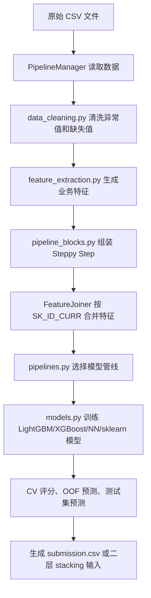

# `open-solution` 开源解答研究导读

本文档面向刚开始做数据分析、机器学习竞赛复现的读者，解释
`open-solution/` 子模块中的 Home Credit Default Risk 开源解答。

这份开源解答不是一份单一脚本，而是一组逐步演进的方案。作者用
`solution-1` 到 `solution-6` 六个 Git tag 记录了从简单 baseline 到二层
stacking 的完整过程。研究它时，最重要的不是立刻跑通最高分版本，而是看懂：

- 数据从哪些 CSV 读入；
- 每张历史表如何被清洗和聚合；
- 特征如何合并回 `SK_ID_CURR` 主样本；
- 模型如何做交叉验证、OOF 预测和 stacking；
- 每一层 solution 相比上一层新增了什么思想。

参考来源：

- 本地子模块：[`../open-solution/`](../open-solution/)
- 上游仓库：<https://github.com/minerva-ml/open-solution-home-credit>
- 官方 Wiki：<https://github.com/minerva-ml/open-solution-home-credit/wiki>
- 当前子模块提交：`0a0a92268974b2cd050ac9ecbf264111036034d7`

## 一句话理解这个项目

`open-solution` 是一套围绕 Kaggle Home Credit Default Risk 的端到端建模管线。
它把原始 CSV 读入后，经过清洗、特征工程、特征拼接、模型训练、交叉验证、
OOF 预测、测试集预测和提交文件生成等步骤，最终输出每个测试样本的违约风险概率。

它的核心方法可以概括为：

1. 先用 `application_train/test` 主表做基础特征。
2. 再把 `bureau`、`previous_application`、`installments_payments` 等历史表按
   `SK_ID_CURR` 聚合成特征。
3. 用 LightGBM 等树模型学习非线性关系。
4. 用 K 折交叉验证生成稳定评估和 OOF 预测。
5. 最后用 stacking 融合多个一层模型。

## 六个 solution tag 总览

| Tag | README 名称 | 公开分数 | 主要新增内容 | 适合学习什么 |
| --- | --- | ---: | --- | --- |
| `solution-1` | LightGBM and basic features | LB 0.742 | 只使用主表中的基础数值/类别字段，训练 LightGBM。 | 建立最小可用 baseline。 |
| `solution-2` | Sklearn and XGBoost algorithms and groupby features | LB 0.747 | 增加 groupby 聚合特征，并加入 XGBoost、随机森林、逻辑回归、SVC 等模型。 | 理解“一对多历史表如何聚合”。 |
| `solution-3` | LightGBM on selected features | CV 0.7840 / LB 0.790 | 代码迁移到 `src/`，加入 EDA notebooks，重点筛选更有效的 LightGBM 特征。 | 学习从 EDA 到特征选择的路线。 |
| `solution-4` | LightGBM with smarter features | CV 0.7905 / LB 0.801 | 增强清洗规则、5 折分层 CV、更多业务化特征和 diff 聚合特征。 | 学习业务特征与交叉验证。 |
| `solution-5` | LightGBM clean dynamic features | CV 0.7950 / LB 0.804 | 修正清洗对聚合特征的覆盖，加入更多动态/时间窗口特征。 | 学习时间窗口和近期行为特征。 |
| `solution-6` | Stacking by feature diversity and model diversity | CV 0.7975 / LB 0.806 | 生成一层 OOF 预测，再用二层模型 stacking 融合。 | 学习竞赛后期融合策略。 |

这些 tag 可以用只读方式研究，不需要真的切换工作区：

```powershell
# 查看某个 tag 下的文件内容
git -C open-solution show solution-4:src/feature_extraction.py

# 查看相邻两层的改动规模
git -C open-solution diff --stat solution-4 solution-5

# 查看 tag 列表和提交信息
git -C open-solution for-each-ref refs/tags --sort=creatordate --format="%(refname:short) %(objectname:short) %(subject)"
```

这种方式不会修改 `open-solution/` 子模块的当前 checkout，比频繁
`git checkout solution-N` 更稳妥。

## 整体运行链路

当前 `master` 代码已经是 solution-6 之后的形态。运行入口是
[`../open-solution/main.py`](../open-solution/main.py)，它使用 `click` 暴露
训练、验证、预测和交叉验证命令。

高层流程如下：



### 核心代码索引

| 位置 | 作用 | 新手阅读建议 |
| --- | --- | --- |
| [`../open-solution/main.py`](../open-solution/main.py) | 命令行入口。 | 先看有哪些命令，例如 `train_evaluate_predict_cv`。 |
| [`../open-solution/src/pipeline_manager.py`](../open-solution/src/pipeline_manager.py) | 负责读数据、切分 folds、训练、评估、预测、保存 OOF。 | 重点读 `_read_data`、`train_evaluate_predict_cv`、`_fold_fit_evaluate_loop`。 |
| [`../open-solution/src/pipelines.py`](../open-solution/src/pipelines.py) | 定义可选 pipeline 名称，如 `lightGBM`、`XGBoost`、`log_reg_stacking`。 | 看 `PIPELINES` 字典，理解命令里的 `--pipeline_name` 对应什么。 |
| [`../open-solution/src/pipeline_blocks.py`](../open-solution/src/pipeline_blocks.py) | 把清洗、特征、预处理、模型封装成 Steppy 的 Step。 | 重点读 `feature_extraction` 和各个 `_application`、`_bureau` helper。 |
| [`../open-solution/src/data_cleaning.py`](../open-solution/src/data_cleaning.py) | 处理异常取值，如 `365243`、`XNA`、异常负值。 | 这是理解“数据不是直接可用”的最佳入口。 |
| [`../open-solution/src/feature_extraction.py`](../open-solution/src/feature_extraction.py) | 大量手工特征、聚合特征、时间窗口特征的主体。 | 按类阅读：先 `ApplicationFeatures`，再还款和历史表。 |
| [`../open-solution/src/pipeline_config.py`](../open-solution/src/pipeline_config.py) | 字段列表、聚合 recipe、模型参数总配置。 | 搜索 `*_AGGREGATION_RECIPIES` 和 `SOLUTION_CONFIG`。 |
| [`../open-solution/configs/neptune.yaml`](../open-solution/configs/neptune.yaml) | 运行参数、数据路径、特征开关、模型超参数。 | 看 `Feature Selection` 区块，理解哪些特征会启用。 |
| [`../open-solution/src/models.py`](../open-solution/src/models.py) | LightGBM、XGBoost、CatBoost、神经网络、sklearn 模型封装。 | 只需先看 `LightGBM` 类，其他模型等读懂主线后再看。 |

## 各层解法怎么演进

### `solution-1`：主表基础特征 + LightGBM

第一层是最朴素的 baseline。它主要使用 `application_train.csv` 和
`application_test.csv` 里的字段：收入、贷款金额、年龄、就业时间、外部评分、
房屋信息、申请人类别信息等。

学习重点：

- 先把问题跑成一个标准二分类任务。
- 明确 `TARGET` 是标签，`SK_ID_CURR` 是 ID，不应作为普通业务特征使用。
- 理解 LightGBM 为什么适合表格数据：能处理非线性、特征交互和缺失值。

可参考位置：

- 早期 tag：`git -C open-solution show solution-1:pipeline_config.py`
- 当前类似配置：[`../open-solution/src/pipeline_config.py`](../open-solution/src/pipeline_config.py)
  中的 `CATEGORICAL_COLUMNS`、`NUMERICAL_COLUMNS`
- 当前模型封装：[`../open-solution/src/models.py`](../open-solution/src/models.py)
  中的 `LightGBM`

### `solution-2`：groupby 聚合特征 + 多模型

第二层开始处理“一对多”的历史数据。比如一个申请人可能有多条 `bureau`
记录、多条历史申请、多条分期还款记录。模型不能直接把这些行横向拼到主表，
所以需要按 `SK_ID_CURR` 做聚合。

常见聚合包括：

- 历史贷款金额的均值、最大值、最小值、方差；
- 历史贷款数量；
- 逾期天数或逾期金额的总和、均值、最大值；
- 不同类别下的计数或比例。

这一层还引入更多模型，方便比较不同算法表现。

可参考位置：

- 聚合 recipe：[`../open-solution/src/pipeline_config.py`](../open-solution/src/pipeline_config.py)
  中的 `BUREAU_AGGREGATION_RECIPIES` 等配置。
- 通用聚合实现：[`../open-solution/src/feature_extraction.py`](../open-solution/src/feature_extraction.py)
  中的 `GroupbyAggregate`。
- 多模型入口：[`../open-solution/src/pipelines.py`](../open-solution/src/pipelines.py)
  中的 `PIPELINES`。

### `solution-3`：EDA、特征选择和代码结构化

第三层的明显变化是项目结构更像一个可维护的工程：核心代码进入 `src/`，
并加入大量 notebooks 做 EDA 和特征观察。

此时研究重点从“能不能训练模型”转向“哪些特征真的有用”。Wiki 中也强调了
`EXT_SOURCE_1/2/3` 以及由它们构造的组合特征在这个比赛里非常强。

可参考位置：

- EDA notebooks：[`../open-solution/notebooks/`](../open-solution/notebooks/)
- 主表特征：[`../open-solution/src/feature_extraction.py`](../open-solution/src/feature_extraction.py)
  中的 `ApplicationFeatures`
- 特征选择开关：[`../open-solution/configs/neptune.yaml`](../open-solution/configs/neptune.yaml)
  中的 `Feature Selection`

建议新手先看：

1. `notebooks/overview.ipynb`
2. `notebooks/eda-application.ipynb`
3. `notebooks/eda_feature_importance.ipynb`

### `solution-4`：更聪明的清洗和业务特征

第四层继续使用单模型 LightGBM，但特征工程明显变强。它开始更认真地处理异常值，
并使用 5 折分层交叉验证来衡量模型稳定性。

典型清洗规则包括：

- `CODE_GENDER == "XNA"` 视为缺失；
- `DAYS_EMPLOYED == 365243` 视为缺失；
- `NAME_FAMILY_STATUS == "Unknown"` 视为缺失；
- 历史申请中的若干 `DAYS_* == 365243` 视为缺失。

典型业务特征包括：

- `credit_to_income_ratio`：贷款金额 / 收入；
- `payment_rate`：年金 / 贷款金额；
- `days_employed_percentage`：就业时间 / 年龄；
- `external_sources_mean`：外部评分均值；
- groupby 后再与个人值做差的 diff 特征。

可参考位置：

- 清洗规则：[`../open-solution/src/data_cleaning.py`](../open-solution/src/data_cleaning.py)
- 主表业务特征：`ApplicationFeatures.fit`
- diff 聚合实现：`GroupbyAggregateDiffs`
- 交叉验证：[`../open-solution/src/pipeline_manager.py`](../open-solution/src/pipeline_manager.py)
  中的 `_get_fold_generator` 和 `train_evaluate_cv_one_run`

### `solution-5`：动态特征和时间窗口

第五层的关键词是“动态”和“近期行为”。作者意识到清洗逻辑不仅要服务手工特征，
也要覆盖聚合特征，否则聚合统计可能吃进异常值。

这一层大量使用“最近 K 天 / 最近 K 月 / 最近 K 笔”的窗口思想，例如：

- 最近 7、30、60、180、360 天的分期还款表现；
- 最近 6、12、24、60 月的 POS/Cash 状态；
- 最近几笔历史申请是否被拒、是否批准、金额变化如何；
- 短窗口与长窗口的比例，用来衡量近期行为是否恶化或改善。

可参考位置：

- 时间窗口参数：[`../open-solution/configs/neptune.yaml`](../open-solution/configs/neptune.yaml)
  中的 `installments__last_k_*`、`pos_cash__last_k_*`、`bureau__last_k_*`
- 分期还款特征：`InstallmentPaymentsFeatures`
- POS/Cash 特征：`POSCASHBalanceFeatures`
- 外部征信月度特征：`BureauBalanceFeatures`
- 工具函数：`add_last_k_features_fractions`、`add_trend_feature`

对新手来说，这一层非常值得慢慢读。它展示了竞赛特征工程中常见的一种思路：
不仅看“历史总体表现”，还要看“最近表现”和“趋势变化”。

### `solution-6`：OOF 预测和二层 stacking

第六层进入竞赛后期融合阶段。它不再只训练一个模型，而是先训练多个一层模型，
保存每个模型在验证折上的 OOF 预测，再用这些 OOF 预测作为二层模型输入。

这里有两个关键概念：

- OOF prediction：对训练集中的每一行，只使用没有见过它的模型来预测，避免标签泄漏。
- Stacking：把多个模型的预测结果当作新特征，再训练一个二层模型学习如何融合它们。

可参考位置：

- 一层 CV 和 OOF 保存：
  [`../open-solution/src/pipeline_manager.py`](../open-solution/src/pipeline_manager.py)
  中的 `train_evaluate_predict_cv`
- 二层模型入口：
  [`../open-solution/src/pipelines.py`](../open-solution/src/pipelines.py)
  中的 `lightGBM_stacking`、`neural_network_stacking`、`log_reg_stacking`
- OOF 读取：
  [`../open-solution/src/utils.py`](../open-solution/src/utils.py)
  中的 `read_oof_predictions`
- stacking 配置：
  [`../open-solution/configs/neptune_stacking.yaml`](../open-solution/configs/neptune_stacking.yaml)

研究这一层前，建议先真正理解前五层。Stacking 很容易让分数变好，但如果没有理解
OOF 的防泄漏原则，就容易写出“看起来分数高、实际不可泛化”的融合。

## 推荐研究路线

### 第一阶段：先读，不急着跑

1. 阅读 [`../open-solution/README.md`](../open-solution/README.md)，确认 6 个 solution
   的公开分数和作者给出的 wiki 链接。
2. 阅读本文档的“六个 solution tag 总览”和“整体运行链路”。
3. 用只读 Git 命令查看每个 tag 的 README 和配置差异。
4. 先看 notebooks 中的 EDA，尤其是主表、外部评分、还款记录和特征重要性。

### 第二阶段：复现最小链路

建议先从 dev mode 和单模型开始，而不是直接跑 solution-6 stacking：

```powershell
cd open-solution

# 查看可用命令
python main.py --help

# 小样本调试：只验证管线能否开始运行
python main.py train_evaluate_predict_cv --pipeline_name lightGBM --dev_mode
```

注意：原 README 中也给出 `python main.py -- train_evaluate_predict_cv --pipeline_name lightGBM`
这种写法。当前 `click` 入口实际是否需要中间的 `--`，取决于当时依赖版本和命令解析。
复现时以本机 `python main.py --help` 输出为准。

### 第三阶段：配置真实数据路径

当前配置文件里的路径还是占位符：

```yaml
train_filepath:                  YOUR/PATH/TO/application_train.csv
test_filepath:                   YOUR/PATH/TO/application_test.csv
bureau_balance_filepath:         YOUR/PATH/TO/bureau_balance.csv
```

本项目的数据在：

```text
data/original/
```

研究时可以复制一份配置到你自己的实验目录，再把路径改成绝对路径或相对路径。
不要直接修改 `open-solution/` 子模块里的配置文件，除非你明确希望子模块变脏。

### 第四阶段：逐层推进

推荐顺序：

1. `solution-1`：主表 + LightGBM，理解 baseline。
2. `solution-2`：加入 groupby 聚合，理解历史表如何变成主表特征。
3. `solution-4`：重点研究清洗、业务特征、分层 CV。
4. `solution-5`：重点研究时间窗口、趋势和近期行为。
5. `solution-6`：最后研究 OOF 和 stacking。

不建议一开始就复现 `solution-6`。它依赖一层模型预测文件、配置切换和更多计算资源，
对新手来说很容易陷入环境问题，而不是学到建模思想。

## 旧环境和复现风险

这份开源解答是 2018 年左右的竞赛代码，依赖版本非常老。当前
[`../open-solution/requirements.txt`](../open-solution/requirements.txt) 中包含：

- `pandas==0.23.1`
- `scikit_learn==0.19.1`
- `lightgbm==2.1.1`
- `xgboost==0.72.1`
- `catboost==0.9.1.1`
- `steppy==0.1.4`
- `neptune-cli`

复现时要注意：

- 老版本 pandas/sklearn 可能无法在当前 Python 版本上直接安装。
- README 曾建议使用 Python 3.5，但后来 `numpy` 又被安全更新到较新版本，
  因此环境 pin 可能需要单独整理。
- Neptune 相关命令主要用于实验跟踪，不是理解模型所必需。
- 如果目标是学习和复现思想，可以先把特征工程逻辑迁移到当前项目自己的脚本或 notebook，
  而不是强行原样运行旧 pipeline。
- 如果目标是严格复现历史分数，应使用独立旧环境，避免污染本项目 `.venv`。

## 新手最该抓住的核心思想

1. 表格竞赛通常不是模型越复杂越好，早期提升主要来自更好的特征。
2. `SK_ID_CURR` 是所有历史信息回到主表的锚点。
3. 一对多历史表要先聚合，再合并回主表。
4. 时间窗口特征能表达“近期状态是否变化”。
5. 交叉验证不只是算分，也用于生成 stacking 所需的 OOF 预测。
6. Stacking 前必须理解防止数据泄漏，否则二层模型会学到不真实信号。

## 快速定位问题的阅读清单

| 问题 | 优先阅读 |
| --- | --- |
| 数据在哪里读？ | `pipeline_manager.py` 的 `_read_data` |
| `--pipeline_name lightGBM` 调到哪里？ | `pipelines.py` 的 `PIPELINES` |
| 哪些特征被启用？ | `configs/neptune.yaml` 的 `Feature Selection` |
| 主表特征怎么构造？ | `feature_extraction.py` 的 `ApplicationFeatures` |
| 历史表怎么聚合？ | `GroupbyAggregate`、`BureauFeatures`、`InstallmentPaymentsFeatures` |
| 清洗了哪些异常值？ | `data_cleaning.py` |
| CV 怎么做？ | `pipeline_manager.py` 的 `_get_fold_generator` |
| OOF 预测怎么保存？ | `train_evaluate_predict_cv` |
| stacking 从哪里读一层预测？ | `utils.py` 的 `read_oof_predictions` 和 `configs/neptune_stacking.yaml` |

## 结论

`open-solution` 最值得学习的地方，不是最后的 0.806 LB 分数本身，而是它清楚展示了
Kaggle 表格竞赛的典型成长路径：先做 baseline，再聚合历史表，再做业务特征和
时间窗口特征，最后用 OOF stacking 融合多个模型。

对本项目而言，最有效的复现方式是先把每一层 solution 的思想拆开，逐步在自己的
notebook 或脚本中复现小块特征，而不是一开始就追求完整运行旧仓库的最终 pipeline。
